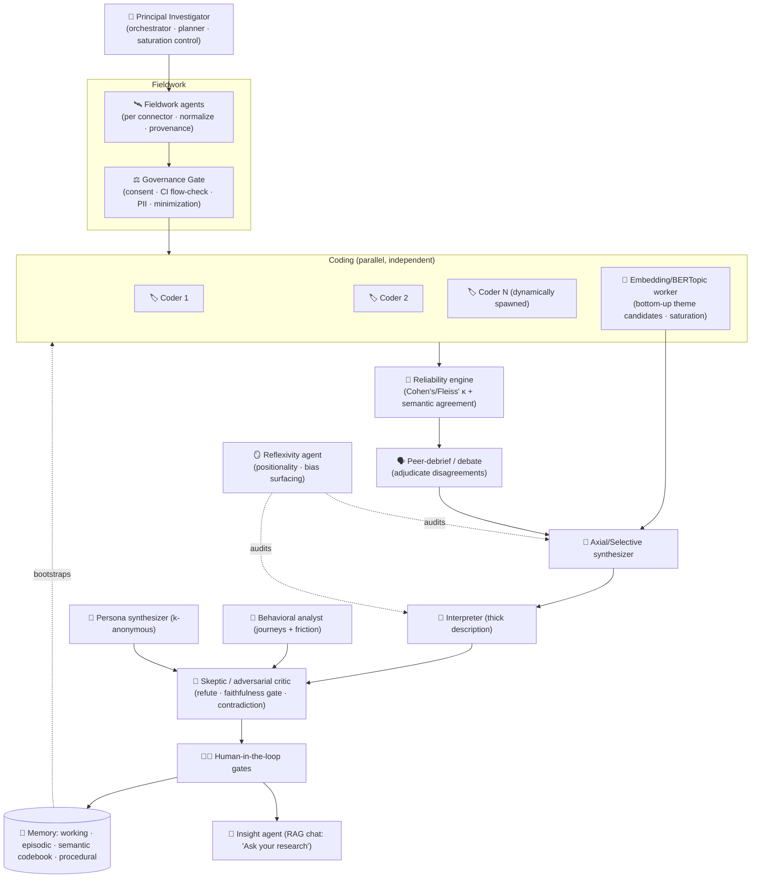

# Digital Ethnographic Intelligence — Product Strategy & Technical Architecture

*A public-facing, AI-native platform for ethical digital ethnographic user research — with a
roadmap from web app → API → MCP suite ("ethnographic intelligence as a service").*

> Status: strategy & architecture v1. Synthesizes five research streams (ethnographic
> methodology & ethics; AI model selection & agentic engineering; data sources & pipeline;
> participant recruitment & panel operations; product/platform & competitive landscape).
> The existing `ethnography/` Python package in this repo is the **reference implementation of
> the governance gate** described in §4 — the ethics kernel that the platform is built around.

---

## 0. TL;DR

- **The wedge.** Every incumbent (Dovetail, Marvin, dscout, UserTesting, Sprig…) runs the same loop:
  *collect a session a researcher deliberately ran → transcribe → AI-tag → synthesize → report.*
  Nobody owns **continuous observation of naturally-occurring digital behavior and culture** as a
  first-class product, with research-grade rigor, provenance, and ethics. That is the white space:
  **the AI ethnographer that watches the field, not just the interviews you recorded.**
- **The moat is three compounding assets, in order:** (1) an **ethics/governance kernel** that lets
  enterprises connect sensitive first-party data without legal fear; (2) a **sophisticated multi-agent
  AI brain** whose rigor (grounding + measured inter-coder agreement + adversarial verification +
  human-in-the-loop) is defensible to expert buyers; (3) an **owned, consent-governed longitudinal
  panel** that produces a compounding, AI-monetizable data stream.
- **The non-negotiable principle** running through every layer: **AI augments a human interpreter;
  it does not replace one.** This is both an ethical stance and the single most important design
  constraint, because the peer-reviewed evidence shows LLM qualitative coding introduces *systematic,
  non-random bias* that does not wash out with scale.
- **The answer to "what recruitment & utilization model should we grow"** (both readings of the
  question) is in §6–§7: a **hybrid centered on an owned longitudinal panel**, fed by marketplace +
  in-product intercept, with public data as *licensed auxiliary signal only*; and an **AI-model
  utilization model that starts single-frontier-model and grows into a routed multi-model fleet**
  priced per-study, not per-seat.

---

## 1. Positioning & the competitive white space

### 1.1 The market has three clusters — and one gap

| Cluster | Examples | What they do | Structural limit |
|---|---|---|---|
| **Research repositories / analysis** | Dovetail (3.0: AI Agents, Ask Dovetail, AI Docs/Dashboards, Canvas), Marvin, Condens, Notably, Looppanel, Aurelius/EnjoyHQ, User Evaluation | Bring-your-own interviews/surveys → transcribe → AI-tag → synthesize → cited reports | Unit of analysis is *a session you ran*. They analyze what you bring; they don't observe the field. |
| **Testing / behavioral** | UserTesting, dscout, Sprig, Maze, Great Question | Moderated/unmoderated tests, in-product feedback, mobile diary studies | Elicited/recruited data. dscout is the closest to "ethnographic" but still relies on recruited participants filming themselves. |
| **Social listening** | Brandwatch, Meltwater | Have the in-the-wild data | Frame it as marketing/PR *sentiment*, not rigorous, cited, culture-level ethnographic insight. |

**The gap (two structural axes):**

1. **Observation vs. elicitation.** No one productizes *observation of naturally-occurring digital
   behavior* — communities, forums, reviews, support logs, in-the-wild usage — as the primary
   substrate, with researcher-grade provenance.
2. **Culture & meaning vs. themes & sentiment.** Incumbents surface *themes* and *polarity*.
   Ethnography's value is **meaning** — norms, identity, rituals, discourse, community dynamics over
   time. We model communities and evolving culture, not just tagged quotes.

### 1.2 Our one-line positioning

> **The AI ethnographer that continuously and ethically observes digital behavior and online culture —
> producing rigorous, cited, longitudinal cultural insight — and exposes that engine to humans (web
> app), systems (API), and other AI agents (MCP).**

The wedge against Dovetail/Marvin: *they analyze what you bring; we watch the field.* The wedge
against dscout: attack its ~$15K–$60K per-study price floor and weak B2B panel, and add the online-
culture observation layer it lacks.

---

## 2. Methodological foundation (what makes it *ethnography*, not analytics)

The platform is organized around a **core methodology** with a **hard ethics backbone**, and a set of
supporting methods. This is what earns credibility with senior UX and academic buyers — and what keeps
us out of legal and reputational trouble.

### 2.1 Core methodology: **Netnography** (Kozinets)

Netnography is purpose-built for online communities and social media, is already *procedural* (so it
maps to software), and ships with a ready-made ethics protocol. Its stages — **initiation →
investigation → immersion → data collection (archival / elicited / produced) → interpretation →
integration** — become the spine of a "study" object in the product. Critically, we implement its
**ethics steps**, not just its data steps: consent thresholds, **anonymization / "cloaking"**, and
**quote fabrication/paraphrase** so verbatim excerpts from small or vulnerable communities can't be
reverse-searched back to a real person.

### 2.2 The ethics engine: **AoIR IRE 3.0 + Contextual Integrity**

This is non-negotiable and architectural (see §4 and §5).

- **AoIR Internet Research Ethics 3.0** (Franzke, Bechmann, Zimmer, Ess) — case-based, lifecycle-wide,
  and vulnerability-scaled: *the greater the vulnerability of the community, the greater the obligation,
  regardless of data accessibility.* "Public ≠ consented."
- **Contextual Integrity** (Nissenbaum) — the most *operationally useful* ethics theory we have:
  privacy = appropriate information **flow** relative to the norms of the original context. Repurposing
  a support-forum post into a research dataset is a **context transgression** even if nothing is
  "leaked." We test every data use against *the norms of the context it came from*, not just a consent
  checkbox. This becomes a concrete gate: `is_appropriate_flow(actor, info_type, transmission_principle)`.
- **Belmont** (respect for persons / beneficence / justice) and **GDPR/CCPA** (lawful basis, data
  minimization, purpose limitation, special-category protection, erasure) are the compliance floor.
  GDPR Recital 26: *pseudonymized data is still personal* — only true anonymization escapes.

### 2.3 Supporting methods we operationalize

| Method | Role in product | AI verdict |
|---|---|---|
| **Grounded Theory** (Glaser & Strauss; Charmaz) — constant comparison, open→axial→selective coding, saturation | The coding pipeline's methodological grounding | Strong fit for AI-*assisted* first-pass coding + retrieval; theory-building stays human |
| **Triangulation** (Denzin) — corroborate across sources/methods | Our defensible differentiator: cross-reference interviews + diaries + traces + community data | Strong fit; frame multi-source synthesis explicitly as triangulation for methodological legitimacy |
| **Trace Ethnography** (Geiger & Ribes) — reconstruct activity from digital exhaust (logs, histories) | Product-analytics-adjacent studies; journey reconstruction | Strong AI fit — but traces are only legible against ethnographic knowledge of what they *mean*; keep human grounding |
| **Diary studies + ESM** (Larson & Csikszentmihalyi) | The *ethically cleanest* data (consented, elicited, longitudinal); early flagship | Strong, low-risk fit; natural software workflow (prompt, transcribe, longitudinal theming) |
| **Reflexive Thematic Analysis** (Braun & Clarke) — *with built-in reflexivity/positionality tooling* | Credibility signal to expert users; forces us to design against AI's flattening | Ship with **honest framing** — see the landmine below |
| **Saturation tracking** (Guest et al.; Hennink et al.) | An AI-operationalizable rigor feature (signal when new codes stop emerging) | Present as a heuristic signal, not proof; ~12–15+ interviews/segment generative, ~5–8 evaluative |

### 2.4 The paradigm landmine (get this wrong and you alienate experts)

Braun & Clarke's **reflexive TA explicitly rejects inter-rater reliability and Cohen's κ** as category
errors — two researchers are *expected* to code differently. But **codebook/positivist TA teams
*want* κ.** So the product must **support both epistemologies and never conflate them**: offer κ-based
agreement as an *optional* codebook-TA feature, and for reflexive work, position multiple AI "coders"
as *interpretive lenses that provoke researcher reflexivity*, not as a march toward "reliable" coding.
**Never market "reliable/objective automated coding."**

### 2.5 The documented risks of LLM qualitative coding (design against these)

Grounded in recent empirical work (Ashwin, Chhabra & Rao 2025; Tai et al. 2024):

- **Thin-for-thick substitution** — LLMs produce fluent surface description and systematically
  over-claim on interpretation (the Geertzian "wink vs. twitch"). *Mitigation:* keep interpretation
  human; treat AI output as candidate observations.
- **Systematic (non-random) bias** — the load-bearing warning: LLM coding errors *correlate with
  subject characteristics*, so they **bias conclusions in a consistent direction** and do **not** wash
  out with sample size. This silently distorts exactly the underrepresented voices research exists to
  surface. *Mitigation:* multi-model coding + bias auditing (§4.5).
- **Hallucination / fabricated quotes & support.** *Mitigation:* strict source-grounding, span-level
  quote verification, RAGAS-style faithfulness gate.
- **Automation bias / false confidence.** *Mitigation:* surface *disagreement and uncertainty*, not
  smoothed answers; make the human adjudicate, not rubber-stamp.
- **Confidentiality leakage** — sending participant data to third-party APIs can itself breach consent,
  GDPR, and contextual integrity. *Mitigation:* PII redaction *before* any model call; self-hostable
  inference path for regulated tenants.

---

## 3. The AI brain — a sophisticated multi-agent architecture

> This is the product. The differentiator is not the model (models are a swappable commodity behind a
> router) — it is **pipeline discipline**: grounding, measured agreement, adversarial verification,
> learning memory, and human gates. Designed to the "go more sophisticated" mandate.

### 3.1 Design stance

Ground the design in **Anthropic's workflow patterns** (prompt chaining, routing, parallelization,
orchestrator-worker, evaluator-optimizer) + reflection, and prefer **deterministic, observable
workflows over free-roaming agents** wherever the pipeline is known — the qualitative pipeline is
largely known. Reserve open-ended agency for genuinely open sub-tasks (fieldsite discovery, adaptive
follow-up interviewing). Mirrors emerging research systems: **LOGOS** (LLM grounded-theory + schema
induction with iterative codebook refinement), **Neo-Grounded Theory** (vector clustering +
multi-agent), **Thematic-LM** (multi-agent TA at scale), **Agent-as-Peer-Debriefer** (perspective-based
multi-agent refinement mirroring qualitative peer debriefing).

### 3.2 The agent "research team"

Each agent is a distinct role with its own model tier, toolset, and memory scope. Every agent is
**retrieval-grounded**: every claim it emits must cite a verifiable source span, or the critic rejects it.



| Agent | Job | Model tier | Notable tools |
|---|---|---|---|
| **Principal Investigator (orchestrator)** | Research question → study plan; decompose; route; **decide when to stop** (saturation); **dynamically spawn more coders** when disagreement/volume is high | Frontier | planner, saturation calculator |
| **Fieldwork agents** (per connector) | Pull + normalize to the canonical Observation model; capture provenance + legal basis at ingest | Small | connector SDK |
| **Governance Gate** | Consent, **Contextual-Integrity flow check**, PII redaction, minimization, sensitivity triage — *hard boundary* | Deterministic + small | Presidio, CI policy engine, audit log |
| **Coder agents ×N (independent, blind)** | Open-code the same units in parallel; emit confidence | Small→mid (cascade) | codebook, structured output, retrieval |
| **Embedding / BERTopic worker** | Bottom-up theme candidates (embed → UMAP → HDBSCAN → label), dedup, saturation novelty signal | Embeddings | vector index, clustering |
| **Reliability engine** | Compute **Cohen's/Fleiss' κ** *and* semantic-similarity agreement across coders; route low-agreement units onward | Deterministic | κ + cosine metrics |
| **Peer-debrief / debate moderator** | Disagreeing coders enter a **structured debate**; adjudicator resolves or escalates to human | Frontier | debate protocol |
| **Axial/Selective synthesizer** | Relate codes → themes → core category (evaluator-optimizer loop) | Frontier | retrieval, codebook memory |
| **Interpreter** | Thick description — situated narrative per theme | Frontier | retrieval |
| **Behavioral analyst** | Journey reconstruction + friction detection from traces/replay | Mid + vision | event-stream + vision fusion |
| **Persona synthesizer** | k-anonymous aggregate portraits *from coded evidence with provenance* | Mid | cohort thresholds |
| **Skeptic / adversarial critic** | Try to **refute** each theme; enforce grounding; **contradiction (NLI) detection**; RAGAS faithfulness gate | Frontier (different family than authors) | NLI, faithfulness scorer, quote-span verifier |
| **Reflexivity agent** | Maintain positionality/assumption memos; surface where model priors may bias interpretation; prompt the human | Frontier | positionality memory |
| **Insight agent** | RAG chat over the analyzed, cited corpus — "Ask your research" | Frontier | retrieval, tools |

### 3.3 The loops that make it *rigorous* (not just fast)

1. **Saturation loop** — track the rate of *new* codes (embedding novelty vs. existing code space);
   stop coding new material for a theme when new-code rate falls below threshold across batches.
   Principled "we've analyzed enough" signal *and* a cost governor.
2. **Reliability loop (signature feature)** — N independent coders (different models and/or
   prompts/temperatures) → **dual metric**: Cohen's/Fleiss' κ *plus* semantic-similarity (catches
   "same meaning, different label"). κ<0.4 poor · 0.4–0.6 moderate · 0.6–0.8 substantial · >0.8
   excellent. **Low agreement auto-escalates** to the debate moderator or a human. Agreement is both a
   quality gate and a headline trust metric shown to customers — *with the epistemology caveat of §2.4*.
   > ⚠️ **AMENDMENT — the independence assumption largely does not hold.** Later adversarial research
   > found that **LLM coder panels have severely correlated errors**: nine frontier judges drawn from
   > seven model families supplied only ~**2 independent votes' worth** of information; panel accuracy
   > fell **8–22pp short** of true independent voting; and the **best single judge often matched or beat
   > the panel.** Multiple models are *not* multiple researchers.
   >
   > **The redesign this forces:** κ is demoted from a *reliability claim* to a **disagreement-surfacing
   > router** — its job is to find the units humans must look at, not to certify correctness. Concretely:
   > (a) maximize decorrelation deliberately — vary *prompt frame, codebook framing, and elicitation
   > order*, not just model family, since family diversity buys far less independence than assumed;
   > (b) **never report κ between models as evidence of validity** — only κ *against a human gold
   > codebook* supports a quality claim; (c) treat high inter-model agreement as **weak** evidence
   > (correlated models agree on their shared errors too), while treating *disagreement* as strong,
   > actionable signal; (d) keep the human gold set as the only real ground truth. This makes the
   > feature honest, and it still delivers its actual value: routing scarce human attention.

3. **Reflection loop** — each coder self-critiques against source + codebook before submitting.
4. **Evaluator-optimizer loop** — theme narratives and codebook definitions are generated → critiqued
   against explicit criteria (grounded? distinct? non-overlapping? ≥N supporting quotes?) → refined.
5. **Adversarial verification loop** — the skeptic must produce a *refuting* quote for each theme;
   survivors are consensus-grounded, the rest flagged. Primary hallucination defense alongside grounding.
6. **Human-in-the-loop gates** — hard checkpoints: (a) **codebook approval** before mass coding,
   (b) **low-agreement / low-confidence review**, (c) **final theme/narrative sign-off**. The human sees
   *evidence + disagreement + confidence*, never a smoothed answer. Every override is logged as eval data.

### 3.4 The sophistication layer: memory, learning, and dynamic scaling

This is what pushes the design beyond a static pipeline into a *learning research organization*:

- **Layered memory.**
  - *Working* — per-study state (current codebook, open questions).
  - *Episodic* — past studies (what was learned, what humans overrode).
  - *Semantic* — a **living codebook / ontology** of codes, themes, and community profiles that
    accumulates across studies. New studies **bootstrap** from relevant prior codebooks — *with explicit
    human opt-in*, because uncritical reuse would import prior bias (a deliberate reflexivity gate).
  - *Procedural* — versioned, tested prompt/skill assets ("prompts are code": versioned, eval-gated).
- **Self-improving codebook.** The evaluator-optimizer loop refines code *definitions* based on
  inter-coder disagreement and human overrides; changes are proposed, human-approved, and versioned.
- **Tool-use per agent.** Agents call real tools — retrieval, κ calculators, BERTopic clustering,
  quote-span verifiers, NLI contradiction checkers, connectors — rather than "reasoning" numbers they
  should compute.
- **Dynamic agent spawning.** The PI scales the coder pool to *difficulty*: more independent coders when
  disagreement is high or the corpus is large; fewer when agreement is trivially high. The "research
  team" right-sizes itself.
- **Structured debate / peer-debrief.** Disagreements aren't averaged away — they're *argued out* by a
  moderated debate agent (Agent-as-Peer-Debriefer), mirroring real qualitative peer debriefing, with the
  human as final adjudicator on persistent splits.

### 3.5 Model selection & routing (the "utilization" that grows)

Advertised context ≠ effective context: multi-fact retrieval degrades badly past ~200K tokens, so
"find every mention across the corpus" is a **RAG job, not a stuff-the-window job.** Task→tier map:

| Task | Tier | Rationale |
|---|---|---|
| Clustering, dedup, retrieval, saturation novelty | **Embeddings** | Cheapest, highest volume; one index serves retrieval + clustering + saturation |
| PII, sentiment (aspect-based), quote extraction, first-pass open coding | **Small model** (Haiku/Flash class) | The bulk of token spend; use structured outputs + fixed codebook |
| Journey analysis, mid-complexity coding | **Mid model** (Sonnet class) | Balance |
| Axial/selective synthesis, thick description, adversarial critique, debate adjudication, cross-study reasoning | **Frontier** (Opus/Gemini-Pro class) | Low volume, high reasoning value; pick on *faithfulness + governance*, not leaderboard deltas (frontier tier is ~interchangeable at κ≥0.84 vs humans when well-prompted) |
| Screenshots / session-replay frames / UI grounding | **Vision model** | Prefer DOM/accessibility text where available; vision as enricher/fallback |
| Non-English segments | **Language-routed** | Keep original-language quotes with provenance; flag low-resource-language findings as lower-confidence; never code off machine translation for anything load-bearing |

**Routing = a tiered cascade** (proven ~85% cost reduction at ~95% of frontier quality): a semantic
router or trained classifier sends each unit to the cheapest capable tier; the small tier codes the bulk
and emits confidence; **only low-confidence / high-disagreement units escalate** to frontier. Route by
*capability profile*, not hardcoded model names, so the fleet is hot-swappable (the frontier turns over
roughly quarterly).

### 3.6 Evaluation & quality (how we keep humans credibly in the loop)

- **Gold-standard human codebooks + κ-vs-human** per study type; report the fleet's agreement with
  humans (frontier reaches κ≈0.71–0.91 *when prompt-engineered*).
- **Faithfulness / groundedness** (RAGAS-style): decompose each output into atomic claims, score the
  fraction supported by retrieved context; a dedicated hallucination detector (entailment model or LLM
  judge) flags unsupported claims. **Faithfulness ≈ 1.0 is a release gate.**
- **LLM-as-judge, carefully** — pairwise not scalar; randomize/swap order and average; **judge model
  from a different family than the generator**; audit judges against human labels. Never let one model
  author, code, *and* solely judge its own work.
- **Observability everywhere** (Langfuse + OTel): every call, cost, confidence, citation, and human
  override logged — both the antidote to agent antipatterns and the substrate for evals.

### 3.7 Cost & scaling (co-designed with the business model)

Diary/ethnographic work is inference-heavy (every entry transcribed → coded → summarized), and cost
scales with *entries × participants × study length*, **not seats** — which is why pricing must be
usage/study-based (dscout-like), not pure per-seat. Levers, stacked:

- **Batch API** (~50% off) — default all non-interactive coding to async batch.
- **Prompt caching** (~90% off cached reads) — cache codebook + system prompt + shared context; batch +
  caching stack to ~95% savings.
- **Cascade routing** — keep ~85% of units on the small tier.
- **Embeddings for dedup/saturation** — stop paying to code redundant/saturated material.
- **Incremental synthesis** — re-analysis doesn't re-run everything; **cost attribution per study**.

**Utilization growth path:** v1 = single frontier model doing everything (fastest to a working
product). Then split out the **cheap coding tier** (biggest win) → add the **embedding/clustering tier**
→ add the **cascade router** → a **multi-model fleet** (different families for coding vs. adjudication
vs. judging — which *also* improves quality and de-risks any single provider). End state: per-unit model
choice is a runtime decision and adding a model is a config change, not a rebuild.

---

## 4. Data pipeline & connectors

**Strategic core: first-party, consented customer data is the product; public social data is thin,
high-risk, *licensed* garnish.** The legal reality below makes DIY scraping a business-model time bomb.

### 4.1 Public sources — access & legal reality (2025–26)

The doctrine that matters: **CFAA is mostly *not* the risk** after *hiQ v. LinkedIn* and *Meta v. Bright
Data* (scraping public, logged-out data). **Breach-of-ToS is** — if you must log in / accept ToS to see
data, scraping it is contractually actionable (hiQ ultimately settled with a permanent injunction, $500K,
and data destruction). **GDPR gives no "publicly available" exemption** (CNIL fined KASPR €240K for
scraping LinkedIn data). Practical tiering:

| Tier | Sources | Posture |
|---|---|---|
| **Official APIs** | Stack Exchange (best-in-class, CC BY-SA), YouTube Data API (10k units/day), **own-app** store reviews (Apple/Google), G2 (paid), Discourse, GDELT/news RSS | Preferred |
| **Licensed brokers** (push legal risk to a vendor with a DPA) | Bright Data, Apify, Data365; **Reddit's commercial license** (~$0.24/1k calls, ~$12k/mo floor) | Use when needed |
| **Never DIY-scrape** | Anything logged-in or ToS-gated: X/Twitter (now pay-per-use, expensive), TikTok (research API bars commercial), Discord (self-bots banned), Amazon reviews (no API text), Glassdoor | Prohibited in architecture |

Build **one abstraction ("external mentions")** over these tiers so downstream code is agnostic to how a
mention was obtained. **Do not let public scraping become a core dependency.**

### 4.2 First-party connectors — the real product

Weighted toward qualitative "voice":

- **Conversation layer (crown jewels):** support desks (**Zendesk / Intercom / Front** — densest
  ethnographic text: real problems in customers' words), interview transcripts (**Gong** best-supported;
  **Recall.ai** as the meeting-bot aggregator normalizing Zoom/Meet/Teams; Grain/Fireflies/tl;dv;
  note **Otter has no official API**), community (**Discourse** clean API; **Slack**).
- **Voice-of-customer:** surveys/NPS open-text (**Typeform / Qualtrics / SurveyMonkey / Delighted**).
- **Behavior:** product analytics (**Amplitude / Mixpanel / PostHog**), and **Segment/RudderStack (the
  CDP) as the single highest-leverage connector** — connect once, fan out everything.
- **Struggle:** session replay (**FullStory / Hotjar / LogRocket**) — heavy PII (screen contents),
  redaction critical.
- **Skeleton:** CRM (**Salesforce / HubSpot**) for firmographic segmentation of all other signal.

**Highest signal-to-effort first: connect at the CDP (Segment) + the conversation layer (Gong/Recall +
Zendesk).**

### 4.3 Pipeline architecture

```mermaid
flowchart LR
    SRC["Sources<br/>(licensed public + first-party OAuth/DPA)"]
    ING["Ingestion: self-hosted Airbyte OSS + custom CDK connectors<br/>(Gong · Recall · Discourse · replay)<br/>+ provenance & legal-basis at ingest"]
    LAKE["Raw lake (S3/GCS, immutable, region-pinned)"]
    PII["PII stage: LLM detector + regex tripwire → token vault<br/>(see §11.6 — regex/NER alone is insufficient)"]
    CANON["dbt: raw → staging → CANONICAL 'Observation'"]
    STORE["Postgres + pgvector (→ Qdrant at scale)"]
    ANALYSIS["AI brain (§3): clustering · coding · κ · synthesis · cited insights"]
    KANON["k-anonymity / min-cohort suppression at OUTPUT"]
    SURF["Web app · REST/GraphQL API · MCP server"]
    SRC --> ING --> LAKE --> PII --> CANON --> STORE --> ANALYSIS --> KANON --> SURF
```



- **Ingestion:** **self-hosted Airbyte (OSS)** for the ~30 commodity connectors (residency + margin +
  maintained catalog), extended with **custom CDK connectors** for the differentiated qualitative
  sources. **Batch by default**; a **streaming lane** (Kafka/CDC) only for support/live-chat "emerging
  issue" detection. Reserve Fivetran only if an enterprise buyer demands it.
- **Provenance envelope at ingest (first-class columns, non-negotiable):** `source_system`,
  `source_record_id`, `connector_version`, `ingested_at`, `original_created_at`, `legal_basis`,
  `consent_ref`, `data_subject_id` (pseudonymized), `tenant_id`, `retention_class`, `residency_region`,
  `pii_flags`. This is what makes erasure and audit *possible at all*.
- **PII:** **Microsoft Presidio** (OSS, in-VPC, no egress) + transformer NER; reversible token vault
  behind a strict access boundary. Redact **before** any model call.
- **Canonical `Observation` model** is the stable seam — every source maps to it, so the AI brain, the
  API, and the MCP server all fall out of one schema (this is exactly the `Observation` dataclass already
  in this repo's `ethnography/schema.py`, scaled up).
- **Storage:** Postgres (structured + provenance) · **pgvector until it hurts** → Qdrant self-hosted at
  scale · S3/GCS raw lake.

### 4.4 Governance & compliance (architectural, not a feature)

- **You wear two hats:** *processor* for customer data, *controller* for anything scraped. Offer DPAs +
  SCCs; document legitimate-interest assessments for any public data.
- **Data residency:** self-hosting Airbyte/Presidio/Qdrant + region-pinned storage → EU-resident
  deployments (an enterprise sales unlock). Multi-region from day one (tenant → region pin).
- **SOC 2 Type II** controls (access, change mgmt, audit logging) started at architecture time, not
  retrofitted.
- **Cascading right-to-erasure:** `data_subject_id` as a join key everywhere → a deletion-orchestration
  job that purges source records, vector entries, token-vault entries, and flags derived aggregates for
  recompute → tombstones + audit proof. Never let raw PII into fine-tuning where it can't be deleted.
- **k-anonymity at output:** suppress any theme/quote attributable to fewer than *k* subjects; prefer
  paraphrased/aggregated insight over verbatim when a quote could re-identify — protecting end-users
  *and* customers' employees (e.g., internal Slack VoC). (This is the persona k-floor already in the
  repo's `analysis/personas.py`, generalized to all outputs.)

### 4.5 Bias auditing (ties back to §2.5)

Audit **sample bias** (whose voices dominate the corpus) *and* **model bias** (does a given model
systematically over/under-code certain groups or languages). Running coding across ≥2 model families and
comparing divergence is both a quality signal and a bias-surfacing mechanism — the direct countermeasure
to the "systematic non-random bias" finding.

---

## 5. Platform architecture & admin

### 5.1 Recommended stack (opinionated)

| Layer | Choice | Why |
|---|---|---|
| Frontend | **Next.js (App Router) + React + TS**, Tailwind + shadcn/ui, TanStack Query; streaming UI for agent output | Default for AI SaaS; Vercel preview envs; edge/streaming |
| App/API tier | **TypeScript** (NestJS or tRPC/Next API) | Web-app velocity |
| AI/agent tier | **Python (FastAPI)** service | Where the LLM/data-eng ecosystem lives; talks to app tier over internal API + queue |
| Auth & tenancy | **Clerk or WorkOS** (orgs, SSO/SAML, RBAC) + **Postgres RLS**, `org_id` on every row *and* every embedding | Enterprise-ready fast; **cross-tenant leakage is the #1 failure mode** — enforce isolation at 3 layers: RLS, vector metadata filters, tenant-scoped gateway keys |
| Data + vector | **Postgres + pgvector** → Qdrant/Pinecone at scale; S3/R2 media | One system for MVP; ACID tenant isolation |
| Orchestration | **Temporal** for durable long-running ingestion/agent workflows + **Redis/BullMQ** for fast async | Continuous observation + multi-day studies need durability, retries, HITL, resumability |
| LLM gateway | **LiteLLM** (self-hosted): OpenAI-compatible over 100+ providers, **per-tenant virtual keys + budgets + spend tracking + PII masking**, Langfuse hooks | Model-agnostic routing + per-tenant cost control + one governance choke point |
| Observability | **Langfuse + OpenTelemetry** (+ Grafana/Sentry) | Trace every agent run for cost/latency/quality evals |
| CI/CD | **GitHub Actions** (lint/typecheck/test/build) + **Vercel preview deploys** + **Neon branch DBs** for ephemeral backends; **Terraform/Pulumi** IaC; **LLM output evals (Langfuse/Promptfoo) as a first-class CI gate** | Preview envs + eval-gated deploys |

### 5.2 Admin / governance console (a differentiator, not overhead)

Because we touch consent, PII, and community data: **tenant management** (orgs, seats, entitlements,
feature flags) · **usage/billing/quotas** (per-tenant token spend, Stripe metering, budgets enforced at
the gateway) · **model & cost controls** (per-tenant model allow-lists, routing policy, max-cost-per-job,
prompt/version management) · **data-source connectors** (authorize, rate-limit, ToS/compliance flags,
connector health) · **consent & audit review** (immutable audit log of every data access + AI action;
GDPR/DSAR retention & deletion tooling) · **content moderation & safety** (PII/sensitive-content review
queue, output guardrails) · **RBAC** (owner/admin/researcher/viewer + super-admin, SSO/SCIM,
impersonation with audit) · **eval console** (review outputs, flag hallucinations, manage eval sets,
prompt A/B).

---

## 6. Recruitment & panel model (answering "what model should we grow")

**Reading 1 — participant recruitment.** For an *ethnographic* product, the recruitment model is the
moat, not a procurement detail. One-off interview tools can rent a marketplace; **longitudinal
ethnography lives or dies on a retained, consenting, richly-profiled panel that stays engaged over
weeks/months.** That is expensive to build and very hard to copy — which is exactly why it's where to
invest. Grow a **hybrid centered on an owned longitudinal panel:**

| Channel | Role |
|---|---|
| **Owned longitudinal panel** (dscout's "Scout" model) | The durable asset & AI-data flywheel. Center of gravity. |
| **Marketplace** (User Interviews; Respondent for hard B2B; Prolific for representative consumer) | Feeder for net-new strangers, quotas, spikes — especially early. |
| **In-product intercept** (our own Ethnio/Sprig-style widget) | Feeder for real-context BYO-users of a customer's live product. High ecological validity (but only existing users). |
| **Public-data observation** | **Auxiliary discovery/trend signal only** — walled off from consented primary research. Never a substitute. |

**Staged:**

- **Stage 1 (early):** don't build a panel. Integrate marketplace APIs + BYO-user intercept. **Win on
  the AI ethnography workflow** (mobile capture → auto-transcribe → grounded AI coding/synthesis), and
  ship **consent-lifecycle tooling** from day one as a differentiator.
- **Stage 2 (growth):** add a **research-hub/CRM layer** so each customer builds & re-contacts *their
  own* longitudinal panel inside the product (Great Question's play). Build fatigue/frequency/rotation +
  re-consent machinery. Longitudinal diary studies become a repeatable product; retention compounds.
- **Stage 3 (scale):** stand up a **proprietary, verified, profiled panel** as premium managed
  recruitment — invest specifically in **B2B/specialist depth where dscout is weak**. Public-data trace
  observation as auxiliary signal.

**Panel operations that matter:** rich persistent profiles (to re-target the same people
longitudinally) · gaming-resistant screeners + verification + **ML detection of AI-generated "cheater"
responses** (the newest critical control) · **incentives** ($60–$100/hr field standard; never <~$50 for
60 min; pay partial on withdrawal; per-entry + completion bonus for diaries without becoming coercive) ·
**fatigue controls** (contact caps, cool-downs, rotation — fatigue is now treated as an *ethical* harm,
not just a data problem) · representativeness/quota management (owned panels drift toward engaged
super-users).

**Consent as a lifecycle object (the hard part of ongoing observation):** continuous/diary ethnography
needs **continuous consent, not point-in-time** — explicit **re-consent checkpoints**, per-entry
"share/don't-share" control, frictionless withdrawal, guidance/tooling for **secondary subjects** (home/
work video captures non-consenting third parties), and heightened safeguards for vulnerable populations.
Making consent-lifecycle management a **first-class, auditable product feature** is both an ethical
necessity and a commercial differentiator enterprise buyers will pay for.

---

## 7. Direct answer: "best total model of recruitment & utilization to grow"

Because the phrase spans both readings, here is the crisp two-part answer:

**Participant recruitment → grow a hybrid with an owned longitudinal panel at the center.** Marketplace +
in-product intercept are *acquisition channels into* the owned panel; public data is *exhaust, not
evidence.* The owned, consent-governed, richly-profiled panel is simultaneously the **moat**, the **AI-
data flywheel**, and the **enterprise-trust differentiator**. Benchmark and beat **dscout** (attack its
price floor and weak B2B panel). Sequence it Stage 1→3 as above — don't build the panel before you've won
on the workflow.

**AI-model utilization → grow from a single frontier model into a routed multi-model fleet.** Start
simple; peel off a cheap coding tier (biggest cost win), then embeddings/clustering, then a cascade
router, then a multi-family fleet where per-unit model choice is a runtime decision. Price **per-study /
usage-based** (not per-seat) so marginal inference is covered, because a longitudinal panel makes cost
scale with *entries × participants × length.* **The two models must be co-designed:** the panel is what
generates the compounding data stream the AI monetizes, and the AI's rigor is what makes the panel's data
worth paying for.

---

## 8. Productizing as a suite (web app → API → MCP)

**One core "ethnographic intelligence engine," three surfaces over the same governed API + gateway** —
the `codex-plugin-cc` lesson: *wrap the engine, don't rebuild the runtime.*

- **(a) Web app** — the researcher UI: connect sources, run observation studies, browse communities/
  discourse, agent-generated cited reports, canvas/dashboard views. Competes on *cultural depth*, not
  tagging.
- **(b) Public REST + GraphQL API** — **REST** for actions/jobs (ingest, run analysis, fetch insights),
  **GraphQL** for the relational insight graph (communities → discourse → themes → evidence). Every
  endpoint returns provenance/citations. Long jobs use the **async submit → job_id → poll status →
  retrieve result** contract borrowed from `codex-plugin-cc`'s `--background/--wait/--resume` +
  `status/result/cancel` ergonomics.
- **(c) MCP server** — so any AI agent (Claude, IDEs, agent frameworks) can call our tools, with the same
  provenance + k-anonymity enforced **server-side**. MCP is a *second transport, not a second system.*

**Patterns to borrow from `openai/codex-plugin-cc`** (it's a Claude Code plugin wrapping OpenAI Codex —
"cc" = Claude Code): thin client over one engine · **async-first job model** · config inheritance with a
**trust boundary** (only load trusted-project/tenant config) · **hook-based gates** (an "insight gate"
that blocks a report until evidence/consent checks pass) · one-command onboarding · ship CI + tests with
the integration.

**Proposed MCP tools/resources** (all tenant-scoped, provenance-returning, k-anon-enforced):

```
Tools:
  search_insights(query, community?, timeframe?)      -> cited insights (RAG Q&A)
  analyze_community(community_id | source)            -> culture/norms/discourse profile
  detect_themes(dataset_id, method?)                  -> themes + evidence quotes
  track_behavior_trend(topic, timeframe)              -> longitudinal discourse/behavior shift
  run_observation_study(sources[], objective)         -> async job_id
  get_job_status(job_id) / get_job_result(job_id)     -> async pattern
  list_quotes(theme, min_cohort=k)                    -> quotes above k-anonymity floor
  generate_report(scope, format)                      -> cited VoC/culture report
Resources:
  ethno://communities/{id}   ethno://insights/{id}
  ethno://studies/{id}/report   ethno://sources
```

Publish to the **MCP Registry**. This makes the platform the *"ethnographic intelligence" capability
other agents depend on* — a durable moat in the agent ecosystem, and the literal realization of your
"API, MCP, and more as a suite" note.

---

## 9. Phased roadmap

| Phase | Theme | Ships |
|---|---|---|
| **0 — Engine + MVP web app** | Prove the wedge | Core engine: ingest 1–2 connectors → embed in pgvector → grounded multi-agent theme/culture analysis → cited insights. Next.js UI, Clerk + RLS, LiteLLM gateway, Langfuse, Temporal. **The governance kernel from this repo, productionized.** Ship the async job model + consent-lifecycle tooling day one. Killer demo: *continuous observation of one digital community with cited, longitudinal cultural insight.* |
| **1 — Depth + governance** | Trust & rigor | More connectors (support/interview/survey/community/replay + licensed public), community & discourse modeling, dashboards/canvas, full PII/provenance/audit + cascading erasure + k-anon, admin console, multi-tenant hardening, **evals in CI**, the reliability engine + adversarial verification. |
| **2 — Public API** | Programmable | REST (jobs) + GraphQL (insight graph) over the same engine, tenant-scoped keys, gateway budgets/rate limits, docs + SDKs. |
| **3 — MCP suite + plugins** | Agent-ecosystem moat | MCP server (stdio + streamable HTTP) → MCP Registry; a Claude Code / IDE plugin wrapping the same engine (`codex-plugin-cc` pattern). |
| **Parallel track** | Recruitment | Stage 1 marketplace + intercept → Stage 2 customer research-hub/panel → Stage 3 owned proprietary panel. |

---

## 11. Infrastructure architecture

> **Posture: sovereignty-first, staged.** This is a solo project, so full sovereignty on day one
> (self-hosted GPU fleet, self-hosted everything, SOC 2 controls) would consume all available time on
> infrastructure instead of product. The resolution: treat sovereignty as an **architectural
> discipline** — choose self-hostable, portable, open-weight-compatible components so nothing
> forecloses sovereignty — while *running* managed services and EU-region managed inference until a
> paying tenant contractually requires otherwise.
>
> **Evidence status.** Each dive below was adversarially fact-checked. Claims are marked
> ✅ verified · ⚠️ partly wrong/corrected · ❌ refuted · ❓ unverifiable in this environment.
> **Every dollar figure here is directional and must be re-quoted before it enters a financial model** —
> the research environment had egress blocked to most vendor hosts.

### 11.1 The two decisions that are one-way doors

Everything else is reversible. These two cost days now and six months later:

1. **A model gateway abstraction from commit #1.** Never call a provider SDK directly from application
   code. Route by *capability profile*, not model name.
2. **A tenant→region pin in the data model, even while there is only one region.** Retrofitting
   residency into a schema that assumes one region is a migration from hell.

Add a third, specific to this product: **provenance edges from commit #1** (§11.5).

### 11.2 Inference — the answer on Hermes and NIM

**Hermes: don't build on it.** ⚠️ *(direction sound; some specifics unverified)*
Hermes 4 (70B/405B) are **Llama-3.1 derivatives** — a 2024 base, 128K context, 8 officially supported
languages, one hosted provider, and low independent intelligence-index scores. Two disqualifiers for
*this* product specifically:
- The **Llama 3.1 Community License** obliges prominent "Built with Meta Llama 3.1" display on the
  product UI — on a *governance-branded* enterprise product.
- Its two selling points have eroded: trained schema adherence is **commoditized by constrained
  decoding** (XGrammar-class, >96–98% conformance on any model, default backend in vLLM/SGLang), and
  its low-refusal behavior is matched by Gemma 4 / Qwen 3.5 at ~0.3–0.5% over-refusal — **without** the
  procurement and prompt-injection liability of a model marketed as having no guardrails. That
  liability is acute here because the moat *is* the ethics kernel and the inputs (forum text, session
  replay, support tickets) are attacker-influenceable.

*Refusals are nonetheless a real methodological problem* — 2.7–20.1% refusal rates on hate-speech
coding tasks, triggered by identity and social-group terms rather than profanity. For a platform that
must analyze stigmatized community discourse, silent refusal is **coverage loss that looks like a
finding**. Measure it explicitly as a quality metric.

**Recommended open-weight cascade:** Qwen3-Embedding (retrieval) · Qwen 3.5 27B / Gemma 4 26B
(high-volume deductive coding) · Qwen 3.5 122B / DeepSeek V4-Flash (inductive coding, synthesis) ·
Mistral Large 3 + Apertus (EU-sovereign SKU) · frontier closed models via **Bedrock EU** for the
hardest synthesis and adjudication.

**NIM: don't adopt it.** ❓ *(pricing unverifiable — see below)*
- ❓ **The ~$4,500/GPU/yr NVIDIA AI Enterprise figure could not be verified from primary sources.**
  Every NVIDIA property was egress-blocked for both the researcher and the independent fact-checker.
  **Get a written NVIDIA/OEM quote before this enters any model.**
- ✅ The direction survives on independent, checkable grounds: **NIM LLM 2.0 is an enterprise wrapper
  around vLLM**, and **NIM ships with prefix caching disabled** (`NIM_ENABLE_KV_CACHE_REUSE=0`) while
  **vLLM ships with automatic prefix caching enabled by default** — so for a shared-codebook fan-out,
  *default NIM is likely slower than default vLLM.*
- **Standardize on vLLM** behind your own OpenAI-compatible abstraction. Revisit NIM only when a
  specific on-prem/air-gapped contract pays the licence as a line item.

❌ **Retracted: the SGLang/RadixAttention thesis.** An earlier draft claimed SGLang's shared-prefix
optimization maps onto the N-coders-share-a-codebook pattern for ~+29%. **This is refuted.** vLLM's
automatic prefix caching is on by default (verified in source), so both engines already eliminate
shared-prefix recompute; an extreme prefix ratio *collapses* the gap rather than amplifying it. The
actual high-value engine tweak is **enabling vLLM's cascade attention, which is off by default.**

**When does self-hosting pay?** ⚠️ *(original band built on retired pricing)*
The original estimate (break-even ≈250k–1.4M coding units/month) used **$15/$75 per MTok**, which is
now only the *deprecated* Opus 4.1 rate. Current frontier Opus is **$5/$25**; Sonnet $3/$15; Haiku
$1/$5. Corrected break-even is therefore **roughly 2–4× higher.** This *strengthens* the conclusion:

> **A sovereign self-hosted pod is a premium compliance product (price it $10k–30k/mo per tenant),
> not a cost optimization.** Self-hosted inference is something a customer buys, not something you
> run to save money.

**EU residency, precisely:** ✅
- **Anthropic first-party has no EU option at all** — `inference_geo` accepts only `global` and `us`,
  and workspace geo is `us`-only and immutable after creation.
- **Bedrock EU / Vertex EU deliver GDPR-grade EU residency today** — this solves the third-party-egress
  problem for most customers without any GPU.
- ⚠️ **The trap:** the Bedrock *EU inference profile* can route to **Zurich (CH) and London (UK) —
  outside the EU/EEA.** Only **in-region endpoints** deliver true EU residency. An enterprise reviewer
  will find this.
- The **EU–US Data Privacy Framework** survives (General Court dismissed *Latombe*, 2025-09-03) but is
  under live CJEU appeal (**C-703/25 P**). **Architect as if DPF will fall:** EU tenant data never
  leaves the EEA by default.

**The sovereignty move that is actually cheap:** self-host **embeddings + PII redaction in your own
VPC**. That keeps the raw participant corpus off third-party infrastructure at trivial cost, while
frontier reasoning runs on Bedrock EU. This captures most of the sovereignty value for a fraction of
the burden — the right answer for a team of one.

**A methodological finding that outranks the cost analysis:** ✅
Model retirement dates are confirmed exactly — Sonnet 3.7 and Haiku 3.5 retired **2026-02-19**, Opus 3
**2026-01-05**, Opus 4.1 retiring **2026-08-05**, with only ~60 days' notice guaranteed.
**Frontier deprecation cycles are incompatible with multi-year longitudinal ethnography:** if the coder
model changes mid-study, *inter-model drift becomes confounded with the cultural change you are trying
to measure.* This is a validity threat, not an ops inconvenience.
→ **Longitudinal studies must pin a model version for the study's life.** That is an argument for
**self-hosted open-weight models on the longitudinal path specifically** — you control the weights, so
the instrument stays constant. Record the model version in the provenance envelope.

### 11.3 Orchestration — Temporal outer, typed Python inner

✅ **Do not make LangGraph (or any agent framework) the orchestration backbone.**
- ✅ **`langgraph-api` — the production server — is Elastic License 2.0**, which prohibits providing
  the software to third parties as a hosted service. That is a direct conflict with a multi-tenant
  SaaS plus public API plus MCP roadmap. (The LangGraph *library* is MIT and genuinely good; the
  *server* is the problem.)
- A March 2026 checkpointer deserialization RCE chain (CVE-2026-27794 / CVE-2026-28277) makes it the
  wrong substrate for a governance kernel holding participant data.

**Temporal** (MIT) is the only evaluated engine satisfying all seven hard requirements: N-way parallel
fan-out with fan-in, human gates that pause for **days**, full resumability without re-paying for LLM
calls, per-step cost attribution, dynamic spawning, namespace-based tenant isolation, and genuine
**cross-language** support (a Python workflow can schedule Activities executed by a TypeScript worker).

**The seam:**
> **Workflow = the study** — durable, versioned, tenant-scoped, HITL-gated.
> **Activity = exactly one bounded, idempotent, cost-attributed LLM or tool call.**
> Everything above the Activity is your own typed code, not a framework's abstraction.

⭐ **The elegant find:** configuring Temporal's `DataConverter` with an encrypting `payload_codec` plus
`ExternalStorage` (threshold 0, S3 driver) keeps **all participant text out of the append-only workflow
event history** — turning the otherwise-intractable "erasure from an immutable event log" problem into
**crypto-shredding**. This is the single best structural answer to GDPR Art. 17 in a durable-execution
system.

✅ Orchestration cost is negligible against inference — roughly **$0.35 of Temporal Actions** versus
**$1,300–2,700 of inference** for a 50,000-entry, 5-coder study. Never optimize the orchestrator.

### 11.4 Observability, evals, and the gateway

✅ **Self-host Langfuse OSS in your own EU VPC.** Verified from source: the free MIT `oss` plan gives
**unlimited** traces, prompts, annotation queues, evaluators and retention; only `rbac-project-roles`,
`audit-logs`, `data-retention`, `admin-api` and two UI features are gated to paid Enterprise.
Self-hosting isn't merely cheaper — it means **the observability system is not a GDPR sub-processor at
all**, the cleanest possible answer to the no-PII-egress constraint.

- **Instrument to vendor-neutral OpenTelemetry GenAI semconv** so Langfuse is a swappable OTLP sink,
  not a dependency. ✅ Note the GenAI conventions remain **pre-stable ("Development")** as of mid-2026 —
  pin versions and expect churn.
- ❌ **Reject Arize Phoenix** — also Elastic License 2.0, same hosted-service prohibition.
- **Self-hosted LiteLLM gateway inside the trust boundary** for per-tenant virtual keys, hard budget
  caps, tiered routing and fallback. **Budget enforcement must be synchronous and upstream** — a trace
  store structurally cannot do it.
- ⚠️ **Never treat the gateway's guardrail as your redaction layer** — only as a tripwire. Gateway
  masking happens *after* your application already handled the raw text.

✅ **Market consolidation to note:** Langfuse → ClickHouse (Jan 2026, MIT/self-hosting commitment
retained) · Promptfoo → OpenAI (Mar 2026, MIT retained) · Portkey → Palo Alto Networks (May 2026) ·
Helicone → Mintlify (now maintenance mode). Choose on license and self-hostability, not on the logo.

### 11.5 Database architecture

**One EU-hosted Postgres is the spine.** Tenants, consent grants, the living codebook, the audit log,
and — critically — a **`derivation_edges` provenance table** plus a **`data_locations` erasure catalog**.

⭐ **Keep embeddings in pgvector *in that same database*, partitioned by `(tenant_id, study_id)`.**
This is the key structural decision: tenant isolation is **inherited from RLS rather than
reimplemented**, which kills the "forgotten metadata filter" class of cross-tenant leakage that OWASP
names (LLM08:2025) as *the* multi-tenant RAG failure mode. Partitioning also converts pgvector's weak
**post-filtering** behavior into **partition pruning** — which matters enormously here because *every*
query in this product is filtered (tenant, study, consent scope, date, code). That single decision is
what makes pgvector viable to roughly **50M vectors**.

✅ **But the highest-value leakage control is not a database feature at all:**
> **Retrieval tools must be structurally incapable of expressing a cross-tenant query.** Tenant scope
> is injected from a **signed job context** — never an agent-supplied parameter. An agent that *cannot
> name* another tenant cannot leak one.

**Add only four supporting stores at MVP:** object storage (**Cloudflare R2** for egress economics;
BYO-bucket for enterprise) · **Redis** (working memory) · **Temporal** (durable studies) ·
**self-hosted Langfuse**.

**Deliberately skip** a graph database, a dedicated search engine, an OLAP warehouse, and every
agent-memory vendor (Zep/Mem0/Letta). Each is another store to isolate, back up, audit, and *erase
from*. None earns that cost yet.

⭐ **On GraphRAG specifically:** it is over-engineering here, for a sharp reason — **the multi-agent
coding pipeline already *is* a domain-specific GraphRAG.** Codes, themes, and evidence edges are the
graph. **Bi-temporal edge tables in Postgres** capture "how culture evolves over time" without a new
store. (⚠️ Also: **Apache AGE has unanswered PG17/PG18 support issues** — it must never gate your
Postgres upgrade cadence. And ⚠️ **MinIO's repo was archived 25 April 2026**, community builds
source-only — it is no longer a viable self-hosted object store.)

⭐ **Provenance is the primary key of the system.** The same edge set that produces your citations makes
cascading erasure a **bounded graph walk** instead of an impossible archaeology project. Pair it with
**per-subject crypto-shredding** (destroy the subject's DEK in KMS) and you are **compliant in seconds**
while re-derivation runs for days — decoupling "legally compliant" from "finished recomputing."
EDPB Guidelines 02/2025 endorse erasure via destruction of decryption keys.

### 11.6 The PII correction

⚠️ **An earlier draft of this document recommended Microsoft Presidio as the core PII layer. That was
wrong.** On the REDACT benchmark Presidio achieves **0.07 recall on high-sensitivity PII** (0.02 on
partial mentions, 0.07 on obfuscated) versus **0.74–0.77 for LLM-based detectors**.

Since redaction must happen **before any model call**, the corrected design is a **two-stage detector**:
a **self-hosted LLM detector in-VPC as the primary**, with **regex/NER as a fast tripwire and
belt-and-braces backstop** — never as the sole layer. This is also the strongest argument for
self-hosting a small model early: *you need an in-VPC model to safely redact before calling any
external one.*

### 11.7 Hosting — and the plain verdict on Hostinger

> ### ❌ Hostinger is not viable as the primary platform, and it is not close.
>
> It offers **no GPU, no managed Kubernetes, no S3-compatible object storage, no managed PostgreSQL,
> no KMS/BYOK, no VPC or private endpoints, and no SOC 2 Type II** — and its SLA remedy is a **5%
> service credit usable only toward further Hostinger purchases**, which alone fails enterprise vendor
> review.
>
> **This is a category mismatch, not a quality judgement.** Hostinger is a competent mass-market host
> being asked to be a cloud platform.
>
> ✅ **It does have a legitimate narrow role:** the **marketing site, docs, and domains**, plus
> non-regulated internal tooling — strictly **outside the SOC 2 scope boundary**, with no shared
> credentials and no network path to production. That is a real, sensible use. Use it there.

**Recommended by stage:**

| Stage | Compute | Data | Inference | Notes |
|---|---|---|---|---|
| **MVP** (solo, pre-revenue) | **Render or Railway, EU region** | Managed Postgres + pgvector, **R2** | **Bedrock EU** (in-region endpoints) + in-VPC embeddings & redaction | Skip Kubernetes entirely. Temporal for durable studies. |
| **Growth** (~50 customers) | **AWS `eu-central-1`, ECS Fargate** | Aurora/RDS + pgvector, per-tenant KMS keys | Same, plus cheap open-weight tier on managed GPU | Startup credits make this cheaper than it looks. |
| **Enterprise / sovereign** | Kubernetes **as a portable deployment artifact** for customer-VPC installs | Region-pinned, BYO-bucket, BYOK | Self-hosted vLLM pod — **sold as a premium SKU** | K8s earns its keep here and only here. |

✅ **You do not need Kubernetes until stage 3.** What you actually need at MVP is **durable execution**
(multi-week studies with multi-day human pauses). Kubernetes' real justification is as the portable
artifact for the sovereign tier — not as an MVP platform.

⚠️ **Cost shape:** model inference is **70–85% of infrastructure cost at MVP** and can reach **~53% of
COGS at scale**. This makes tiered routing, prompt caching, Batch API, and **hard per-tenant token caps
existential rather than optimizations**. It also means:

> ⚠️ **"Dynamic agent spawning scaled to disagreement" (§3.4) is an unbounded cost amplifier and must
> carry an explicit hard cap.** A pathological corpus where coders never converge would otherwise spawn
> without limit. Cap it, and treat the cap being hit as a signal to escalate to a human.

### 11.8 Two legal risks nobody asked about — but that land on core differentiators

Surfaced unprompted by the research; both warrant counsel review:

1. **GDPR Article 9 special-category data appears routinely in interview transcripts and community
   discourse** (health, ethnicity, politics, sexuality, union membership). The product's *most valuable*
   sources are the ones most likely to carry it. The existing kernel's `SENSITIVE` category and
   default-deny posture is the right shape — but Art. 9 needs an explicit lawful basis, not just
   consent-by-default.
2. **The EU AI Act prohibits emotion recognition in the workplace.** Any "sentiment/emotion" feature
   applied to employee-adjacent data (internal Slack VoC, support agents, employee research) may be a
   **prohibited practice**, not merely a regulated one. This lands directly on a planned capability
   (§3.3 "sentiment/emotion"). Scope it out of workplace contexts, or scope it out entirely.

### 11.9 Recommended stack — the one-page answer

| Layer | Choice | Why |
|---|---|---|
| **Hosting (MVP)** | Render/Railway EU → AWS `eu-central-1` | Compliance-capable without ops burden; **Hostinger for marketing site only** |
| **Orchestration** | **Temporal** (MIT), typed Python inside | Only engine meeting all 7 requirements; crypto-shredding via payload codec |
| **Agent layer** | **Your own typed code** — no framework backbone | `langgraph-api` is Elastic 2.0 = hosted-service prohibition |
| **Relational + vector** | **One Postgres**, pgvector partitioned by `(tenant_id, study_id)` | Isolation inherited from RLS; kills the #1 RAG leak class |
| **Provenance** | `derivation_edges` + `data_locations` from commit #1 | Citations *and* bounded-graph-walk erasure from one structure |
| **Erasure** | Per-subject **crypto-shredding** (KMS DEK) | Compliant in seconds, re-derivation async |
| **Object storage** | **Cloudflare R2** (BYO-bucket for enterprise) | Egress economics; **MinIO is archived — avoid** |
| **Inference (default)** | **Bedrock EU in-region endpoints** | Real EU residency; Anthropic first-party has **no** EU option |
| **Inference (in-VPC)** | **vLLM** — embeddings + PII redaction first | Cheap sovereignty; needed *before* any external call |
| **Inference (sovereign SKU)** | vLLM pod, pinned open weights | Premium product at $10k–30k/mo — **not** a cost play |
| **Open weights** | Qwen 3.5 / Gemma 4 / Mistral Large 3 — **not Hermes** | Licensing, recency, languages, no "no-guardrails" liability |
| **Gateway** | **Self-hosted LiteLLM** | Per-tenant keys + synchronous hard budget caps |
| **Observability** | **Self-hosted Langfuse** (MIT `oss`), OTel-instrumented | Not a sub-processor at all; swappable sink |
| **Skip at MVP** | Graph DB · search engine · OLAP · agent-memory vendors · Kubernetes | Each is another store to isolate, audit and erase from |

---

## 10. Top risks & how the architecture answers them

| Risk | Mitigation (where) |
|---|---|
| **LLM systematic bias distorts findings** (peer-reviewed, doesn't wash out with scale) | Multi-model coding + bias auditing (§4.5); human-in-the-loop gates; surface disagreement (§3.3) |
| **Hallucinated quotes/claims** | Retrieval grounding + span-level quote verification + RAGAS faithfulness release gate + adversarial critic (§3.3, §3.6) |
| **Alienating expert users on epistemology** | Support both reflexive-TA and codebook-TA; never sell "reliable automated coding" (§2.4) |
| **Legal exposure from public data** | First-party-first; licensed brokers with DPAs; never DIY-scrape ToS-gated sources (§4.1) |
| **Cross-tenant data leakage** (#1 SaaS failure mode) | RLS + vector metadata filters + tenant-scoped gateway keys (§5.1) |
| **Right-to-erasure across derived data** | `data_subject_id` join key + cascading deletion orchestration + tombstones (§4.4) |
| **Re-identification of individuals/employees** | Output k-anonymity + quote cloaking/paraphrase (§2.1, §4.4) |
| **Consent for continuous observation & bystanders** | Consent-as-lifecycle, re-consent checkpoints, per-entry sharing control, secondary-subject tooling (§6) |
| **Runaway inference cost** | Cascade routing + batch + caching + saturation stop + per-study cost attribution (§3.7) |
| **Model churn (frontier turns over quarterly)** | Model-agnostic router; route by capability profile; adding a model is config (§3.5) |

---

## Appendix — key sources by stream

**Methodology & ethics:** Geertz, *The Interpretation of Cultures* (thick description); Glaser & Strauss;
Charmaz, *Constructing Grounded Theory*; Braun & Clarke, reflexive TA (tandfonline.com/doi/abs/10.1191/
1478088706qp063oa); Kozinets, *Netnography* (2020); Hine, *Virtual Ethnography*; Geiger & Ribes, "Trace
Ethnography" (stuartgeiger.com/trace-ethnography-hicss-geiger-ribes.pdf); Guest/Bunce/Johnson, "How Many
Interviews Are Enough?"; **AoIR IRE 3.0** (aoir.org/reports/ethics3.pdf); Belmont Report
(hhs.gov/ohrp/…/belmont-report); **Nissenbaum, "Privacy as Contextual Integrity"**; Ashwin/Chhabra/Rao,
"Using LLMs for Qualitative Analysis Can Introduce Serious Bias" (2025, doi.org/10.1177/00491241251338246);
Tai et al. (2024).

**AI brain:** Anthropic, "Building Effective Agents" (anthropic.com/engineering/building-effective-agents);
Multi-LLM Thematic Analysis w/ dual reliability (arxiv.org/abs/2512.20352); LOGOS (arxiv.org/pdf/
2509.24294); Neo-Grounded Theory (arxiv.org/pdf/2509.25244); Agent-as-Peer-Debriefer (arxiv.org/pdf/
2605.24600); BERTopic (emergentmind.com/topics/bertopic); RouteLLM (arxiv.org/pdf/2410.10347); RAG
faithfulness (arxiv.org/pdf/2505.04847); LLM-as-judge position bias (arxiv.org/abs/2406.07791); prompt
caching economics (leanlm.ai/blog/prompt-caching).

**Data pipeline:** hiQ v. LinkedIn; Meta v. Bright Data (fbm.com/publications/…meta-platforms-v-bright-
data); EDPB/CNIL web-scraping guidance; Reddit API pricing (socialcrawl.dev/blog/reddit-data-api-2026);
Airbyte vs Fivetran vs Meltano (portable.io/learn/fivetran-vs-airbyte-comparison); Microsoft Presidio
(github.com/microsoft/presidio); Recall.ai / Gong integration.

**Recruitment & panel:** dscout pricing & methods (cleverx.com/blog/dscout-pricing-plans-and-costs-
explained-2026; dscout.com/platform/methods/diary-studies); Respondent/Prolific/User Interviews
comparisons; Klykken (2022) "continuous consent" (journals.sagepub.com/doi/10.1177/14687941211014366);
research incentives & fatigue guides (Great Question, User Interviews).

**Product/platform:** Dovetail Fall 2025 launch (dovetail.com/blog/2025-fall-launch); Marvin Deep
Research; multi-tenant AI SaaS patterns; LiteLLM vs OpenRouter; Langfuse + LiteLLM OSS LLMOps stack; MCP
design guidelines (AWS Labs github.com/awslabs/mcp/blob/main/DESIGN_GUIDELINES.md;
modelcontextprotocol.io); `openai/codex-plugin-cc`.

*Note: model version numbers and API prices (esp. Reddit/X) reflect mid-2026 sources and move fast —
treat tiering logic as durable and exact figures/model IDs as config to re-verify at build time.*
